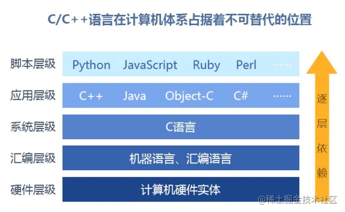

[Android JNI和NDK学习（基础篇）：C语言基础](https://juejin.cn/post/6844904110991343629)

Android NDK学习（一）C语言基础语法

## 前言

> C语言对于Android开发来说还是非常必要的，不管你是要阅读源码，还是想要学习NDK，音视频，性能优化等，都不可避免需要接触到C；
而且C语言属于系统级的语言，操作系统内核都有C的身影，作为一名科班出身的程序员，在毕业7年以后决定重新捡起这门语言。



## 一、C语言简介

### 1.1 C语言特点

C语言最初适用于系统开发工作的，特别是组成操作系统的程序，由于C语言产生的代码运行速度与汇编编写的代码运行速度几乎相同，所以采用C语言作为系统开发语言，
下面列举几个使用C的实例
- 操作系统
- 文本编辑器
- 打印机
- 网络驱动器等
- 
### 1.2 C语言开发环境

市面上能够进行C语言开发的编译器非常多，最经典的当然还是VC6.0，还有VS系列，以及MAC上的XCode，这里我使用的是CodeBlock；
关于编译器的下载和安装，请自行解决

### 1.3 Hello World

```c
#include <stdio.h>
#include <stdlib.h>

int main()
{
    /*
    我是一行注释
    */
    printf("Hello world!\n");
    return 0;
}

```
一个C程序一般包括以下几个部分：

- 预处理器指令 : 程序的第一行#include <stdio.h>是预处理指令，告诉C编译器实际编译之前需要包括stdio.h文件
- 函数 ： 下一行int main()是主函数，程序从这里开始运行，printf()是程序中另一个可用的函数作用是在屏幕上显示Hello, World!
- 变量
- 语句&表达式
- 注释： /* ... */这就是一个注释
- return 0;标识此函数结束，并返回0


## 二、C语言入门

### 2.1 标识符

标记符是用来标记变量，函数或者任何用户自定的变量名称，一个标识符以字母A—Z，a-z,或者_下划线开始,后面跟0个或多个字母，数字，下划线

标识符中不允许出现标点字符，比如@%，标识符是区分大小写的

### 2.2 关键字

这些关键字不能作为常量名或者变量名，其他标识符的名称

|  关键字   | 说明  |
|  ----  | ----  |
| continue  | 结束当前循环，开始下一轮循环 |
| switch  | 用于开关语句 |
| case  | 开关语句分支 |
| default  | 开关语句中的其他分支 |
| break  | 跳出当前循环 |
| do  | 循环语句的循环体 |
| while  | 循环语句的循环条件 |
| if  | 条件语句 |
| else  | 条件语句否定分支与if一起使用 |
| for  | 一种循环语句 |
| goto  | 无条件跳转语句 |
| return  | 子程序返回语句，可带参数可不带参数 |
| char  | 声明字符变量或者返回值类型 |
| double  | 声明双精度浮点类型对象或函数返回值类型 |
| float  | 声明浮点型变量或返回值类型 |
| short  | 声明短整形变量或者返回值类型 |
| int  | 声明整形变量或者返回值类型 |
| long  | 声明长整形变量或返回值类型 |
| unsigned  | 声明无符号类型变量或返回值类型 |
| void  | 声明函数无返回值或无参数，声明无类型指针 |
| enum  | 声明枚举类型 |
| static  | 声明静态变量 |
| void  | 声明函数无返回值或无参数，声明无类型指针 |
| auto  | 自动声明变量 |
| const  | 定义常量，如果一个变量被const修饰，则它的值不能被改变 |
| extern  | 声明变量或函数在其他文件或本文件的其他位置定义 |
| register  |声明寄存器变量 |
| signed  | 声明有符号类型的变量 |
| sizeof  | 计算数据类型或变量的长度 |
| struct  | 声明结构体类型 |
| union  | 声明共用体 |
| typedef  | 给数据类型取别名 |
| volatile  | 说明变量在执行过程中可以隐含的改变 |

**可以看到70%都是java中有的，学习起来并不是很难**


### 2.3 数据类型

C中的数据类型可以分为以下几种

### 2.3.1 整数类型

| 类型             | 存储大小   | 值范围                                                |
|----------------|--------|----------------------------------------------------|
| char           | 1字节    | -128-127或0-255                                     |
| unsigned char  | 1字节    | 0-255                                              |
| signed char    | 1字节    | -128-127                                           |
| int            | 2或4字节  | -32,768 到 32,767 或 -2,147,483,648 到 2,147,483,647  |
| unsigned int   | 2或4字节  | 0 到 65,535 或 0 到 4,294,967,295  |
| short          | 2字节    | -32,768 到 32,767  |
| unsigned short | 2字节    | 0 到 65,535  |
| long           | 4字节    | -2,147,483,648 到 2,147,483,647 |
| unsigned long  | 4字节    | 0 到 4,294,967,295 |

各类型的储存大小，与系统位数有关，为了得到准确大小可以用sizeof来计算
```c
#include <stdio.h>
#include <limits.h>
int main(){
    printf("int 存储大小 : %lu \n", sizeof(int));
    return 0 ;
}
```
> int 存储大小 : 4 

### 2.3.2 浮点类型

| 类型             | 存储大小  | 值范围                   | 精度  |
|----------------|-------|-----------------------|-----|
| float           | 4字节   | 1.2E-38 到 3.4E+38     | 6 位小数    |
| double           | 8字节   | 2.3E-308 到 1.7E+308   | 15位小数    |
| long double           | 16字节   | 3.4E-4932 到 1.1E+4932 | 19位小数    |

### 2.3.3 void类型

| 类型             | 描述                                                                                        | 
|----------------|-------------------------------------------------------------------------------------------|
| 函数返回为空 | C 中有各种函数都不返回值，或者您可以说它们返回空。不返回值的函数的返回类型为空。例如 void exit (int status);                       | 
| 函数参数为空 | C 中有各种函数不接受任何参数。不带参数的函数可以接受一个 void。例如 int rand(void);                                     | 
| 指针指向void | 类型为void*指针代表对象的地址，而不是类型，例如，内存分配函数 void *malloc( size_t size ); 返回指向 void 的指针，可以转换为任何数据类型。 | 


### 2.4 变量

变量是程序可操作的储存区名称，C中每个变量都有特定的类型，类型决定了变量的大小和布局，该范围内的值都可以储存在内存中

C语言中有基本数据类型的变量，也可以有其他类型的变量，比如数组，指针，枚举，结构体，共用体等

变量的定义
变量的定义就是告诉储存器何处创建变量的储存，以及如何创建变量的储存，变量定义指定数据类型，并包含该类型的一个或多个变量列表

